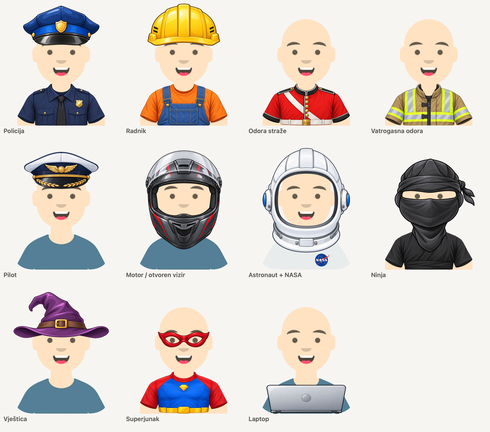

# Costume assets

Sixteen independently selectable additions to the existing avatar catalog. All headwear belongs to Accessories (`Addition`), including the older hats, hijab, turban, and winter/Santa hats. The seven new caps and helmets use accessory IDs 41...47. Accessories use high-word bit 44 for values above 31; see [the hex ID reference](hex-id.md).



This is an artwork placement proof composed from the package assets and XIB coordinates with AppKit. It is not an app screenshot.

## Catalog

| Asset | Editor category | Raw value | Canvas (pt) | Artwork frame (x, y, w, h) |
| --- | --- | ---: | --- | --- |
| `PoliceCap` | Addition | 41 | 266 x 280 | 57, 17, 152, 79 |
| `ConstructionHelmet` | Addition | 42 | 266 x 280 | 61, 27, 144, 70 |
| `PilotCap` | Addition | 43 | 266 x 280 | 59, 21, 148, 74 |
| `MotorcycleHelmet` | Addition | 44 | 266 x 280 | 57, 20, 152, 197.5 |
| `AstronautHelmet` | Addition | 45 | 266 x 280 | 44, 13, 178, 213.25 |
| `NinjaHood` | Addition | 46 | 266 x 280 | 55, 30, 184, 203 |
| `WitchHat` | Addition | 47 | 266 x 280 | 25, 2, 216, 105 |
| `PoliceUniform` | Clothing | 34 | 264 x 110 | 32, 14, 200, 96 |
| `WorkerOveralls` | Clothing | 35 | 264 x 110 | 32, 14, 200, 96 |
| `GuardsUniform` | Clothing | 36 | 264 x 110 | 32, 14, 200, 96 |
| `FireUniform` | Clothing | 37 | 264 x 110 | 32, 14, 200, 96 |
| `NinjaSuit` | Clothing | 38 | 264 x 110 | 32, 14, 200, 96 |
| `SuperheroSuit` | Clothing | 39 | 264 x 110 | 32, 14, 200, 96 |
| `Laptop` | Addition | 25 | 264 x 280 | 41, 214, 182, 66 |
| `HeroMask` | Glasses | 21 | 142 x 54 | 12, 8, 118, 36 |
| `NASALogo` | ClothLogo | 27 | 110 x 44 | 37, 4, 36, 36 |

## Rendering

Police, pilot, and motorcycle headwear use a 1.15 display scale in both axes. The construction helmet uses 1.15 horizontally and 1.38 vertically. The witch hat requests a 1.38 scale and the astronaut helmet 1.15; only those headwear layers are fitted to the available canvas around their brim/eye anchors. Selecting headwear never scales or shifts the full avatar. Body, eyes, and clothing retain their existing geometry. The witch hat hides the covered scalp above avatar y=100 so skin cannot show beside its crown.

The lower sections of the motorcycle and astronaut helmets were extended downward by 25%. The ninja hood now has a rounded lower mask and shorter side ribbons. It uses a 1.06 vertical scale around the eyes, with small horizontal adjustments for broad (1.04) and very broad (1.11) faces. It no longer uses the local cheek-warping algorithm, which created pointed sides. The earlier long, narrow neck treatment remains part of the artwork.

New headwear, uniforms, the laptop, and the eye mask preserve their original colors. The editor hides color controls for these fixed-color options. Clothing uses the existing 64-point torso mask to hide skin outside its shoulders. The six costume garments restore the full body width below their short sleeve cuffs (body-local y=222, avatar y=258), so exposed arms retain the selected skin color and shading.

The ninja hood covers the mouth, nose, and facial hair. The motorcycle helmet has a raised visor and covers the mouth and facial hair behind its chin guard. The astronaut helmet covers facial hair. Changing headwear restores those views; selections remain saved. Headwear and the raised hood are mutually exclusive accessory choices. They preserve the selected hairstyle and hair color, which reappear when headwear is removed. Tintable hats use the independent accessory color. The eyepatch is also an accessory and leaves the hairstyle visible. The laptop appears in front of the torso.

PNG assets use a transparent 3x canvas. Importing only crops to alpha bounds and resizes into the frame above; generated alpha and colors are preserved. The NASA logo is aspect-fitted into its frame.

## Artwork provenance

Fifteen retained costume illustrations were created with the built-in `image_gen.imagegen` tool. The NASA logo was downloaded from [NASA's official site](https://www.nasa.gov/wp-content/themes/nasa/assets/images/nasa-logo@2x.png); see the [NASA Brand Center](https://www.nasa.gov/nasa-brand-center/) for its usage guidelines. This logo is a separate original-color layer and was not AI-generated. See the repository's [artwork licensing status](../LICENSING.md).

### Generation prompts

#### PoliceCap

Master: `exec-7f93d55f-fe45-4577-b2c4-dcd473ab94c2.png`

```text
Use case: style-transfer. Asset type: layered avatar Top sprite. Create new sibling asset PoliceCap. Reference image is for rendering STYLE ONLY, not object design or horns. Subject: a police officer's peaked cap, deep navy blue crown, glossy black curved visor, blue cap band, small centered golden generic shield badge. Symmetric straight-on FRONT view; solid cap only with empty space below brim, no dangling straps. No words, no country-specific insignia. Keep the reference's polished shaded 2.5D mobile-game illustration style, crisp thin outlines and clean antialiasing; replace the subject entirely. Render exactly ONE isolated item, centered and fully visible with small transparent margin, on genuinely transparent alpha, including all openings. No checkerboard or background haze, no ground shadow, no human/mannequin, no extra objects. Use colors described, not grayscale. 
```

Alpha cleanup prompt:

```text
Use case: background-extraction. Edit target is the attached isolated cap/helmet illustration. Remove EVERY bit of the colored glow, soft haze, gradient, black backdrop and any shadow OUTSIDE THE HARD OBJECT EDGE, making those pixels genuinely fully transparent alpha=0. Preserve the cap/helmet itself exactly: shape, size, colors, badge, highlights, brim and solid outer contour. No new design or extra elements. Keep original canvas. Only the actual cap/helmet should remain with a crisp antialiased alpha edge and NO halo. No checkerboard painted into the result.
```

#### ConstructionHelmet

Master: `exec-06f7d332-837a-4ac9-aba4-ea94700693cf.png`

```text
Use case: style-transfer. Asset type: layered avatar Top sprite. Create new sibling asset ConstructionHelmet. Reference image is for rendering STYLE ONLY, not object design or horns. Subject: a bright construction-yellow hard hat, rigid rounded shell with three subtle reinforcing ridges and a short forward brim, small side vents, illustrated plastic highlights. Symmetric straight-on FRONT view; only hard hat, no dangling straps, no objects below brim, no text. Keep the reference's polished shaded 2.5D mobile-game illustration style, crisp thin outlines and clean antialiasing; replace the subject entirely. Render exactly ONE isolated item, centered and fully visible with small transparent margin, on genuinely transparent alpha, including all openings. No checkerboard or background haze, no ground shadow, no human/mannequin, no extra objects. Use colors described, not grayscale. 
```


#### PilotCap

Master: `exec-0a2fab42-15d8-4c69-812d-3cc574e1fc07.png`

```text
Use case: style-transfer. Asset type: layered avatar Top sprite. Create new sibling asset PilotCap. Reference image is for rendering STYLE ONLY, not object design or horns. Subject: an airline pilot captain's peaked cap, midnight navy crown, white upper crown panel, dark navy cap band, black curved visor with delicate gold leaf trim, centered gold wing badge. Symmetric straight-on FRONT view. Cap only, no hanging pieces, no words. Keep the reference's polished shaded 2.5D mobile-game illustration style, crisp thin outlines and clean antialiasing; replace the subject entirely. Render exactly ONE isolated item, centered and fully visible with small transparent margin, on genuinely transparent alpha, including all openings. No checkerboard or background haze, no ground shadow, no human/mannequin, no extra objects. Use colors described, not grayscale. 
```

Alpha cleanup prompt:

```text
Use case: background-extraction. Edit target is the attached isolated cap/helmet illustration. Remove EVERY bit of the colored glow, soft haze, gradient, black backdrop and any shadow OUTSIDE THE HARD OBJECT EDGE, making those pixels genuinely fully transparent alpha=0. Preserve the cap/helmet itself exactly: shape, size, colors, badge, highlights, brim and solid outer contour. No new design or extra elements. Keep original canvas. Only the actual cap/helmet should remain with a crisp antialiased alpha edge and NO halo. No checkerboard painted into the result.
```

#### MotorcycleHelmet

Master: `exec-51da37c2-3bed-4d00-b4e2-f9de08743920.png`

```text
Use case: style-transfer. Create one new layered avatar sprite named MotorcycleHelmet. Reference for polished 2.5D illustration STYLE ONLY. Subject: a modern full-face motorcycle helmet in glossy charcoal with subtle red accents. OPEN VISOR: clear visor is hinged UP above the forehead, the face window is a completely transparent large empty opening, no tinted glass over eyes. Symmetric straight-on FRONT view. Shell encloses sides, crown and chin guard. Face window occupies x=14%..86% of the helmet width and y=32%..87% of its height, smooth rounded rectangular inner contour, very large enough for eyes/nose/mouth. Lower chin bar only in bottom 13% of helmet. No human head, hair, skin, face, eyes or interior background. Keep the reference's polished shaded 2.5D mobile-game illustration style, crisp thin outlines and clean antialiasing; replace the subject entirely. Render exactly ONE isolated item, centered and fully visible with small transparent margin, on genuinely transparent alpha, including all openings. No checkerboard or background haze, no ground shadow, no human/mannequin, no extra objects. Use colors described, not grayscale.  CRITICAL: every pixel outside the actual object must be alpha=0. No surrounding glow, gradient, bloom, blurred shadow or dark background. This is a transparent cutout game sprite, NOT an illustration on a backdrop.
```

#### AstronautHelmet

Master: `exec-5a21a6d5-6221-4395-ad76-fca7d1cdc8c9.png`

```text
Use case: style-transfer. Create one new layered avatar sprite named AstronautHelmet. Reference for polished 2.5D illustration STYLE ONLY. Subject: a white astronaut EVA space helmet with rounded white shell, restrained light gray seams, small blue side fittings, and a short circular neck ring. Symmetric straight-on FRONT view. HUGE entirely transparent empty face window, no face, head, glass tint or reflection inside the window. Clear open window x=18%..82% of helmet width and y=23%..87% of helmet height, gently rounded sides and rounded chin opening. Outer white shell rim continuous, little life-support fittings on sides, clean lower collar. No text, logos, hoses, shoulders or suit. Keep the reference's polished shaded 2.5D mobile-game illustration style, crisp thin outlines and clean antialiasing; replace the subject entirely. Render exactly ONE isolated item, centered and fully visible with small transparent margin, on genuinely transparent alpha, including all openings. No checkerboard or background haze, no ground shadow, no human/mannequin, no extra objects. Use colors described, not grayscale.  CRITICAL: every pixel outside the actual object must be alpha=0. No surrounding glow, gradient, bloom, blurred shadow or dark background. This is a transparent cutout game sprite, NOT an illustration on a backdrop.
```

#### NinjaHood

Master: `exec-bde93f56-2e0a-4d28-b793-c722ae8bc17a.png`

```text
Use case: style-transfer. Create one new layered avatar sprite named NinjaHood. Reference for polished 2.5D illustration STYLE ONLY. Subject: a black/dark-charcoal ninja cloth hood with black fabric mask covering nose, mouth, cheeks and neck. Straight-on FRONT view. ONE broad horizontal completely transparent eye slit across x=10%..90% width and y=35%..55% height, with gently angled upper edge, enough space for both eyebrows and eyes. All remaining hood/mask fabric is opaque. No drawn eyes, no face, no nose or skin. Dark cloth folds visible in gray highlights, a small tied black cloth knot trailing to one side. Rounded crown with no ears, no hair. Short neck end. Keep the reference's polished shaded 2.5D mobile-game illustration style, crisp thin outlines and clean antialiasing; replace the subject entirely. Render exactly ONE isolated item, centered and fully visible with small transparent margin, on genuinely transparent alpha, including all openings. No checkerboard or background haze, no ground shadow, no human/mannequin, no extra objects. Use colors described, not grayscale.  CRITICAL: every pixel outside the actual object must be alpha=0. No surrounding glow, gradient, bloom, blurred shadow or dark background. This is a transparent cutout game sprite, NOT an illustration on a backdrop.
```

#### WitchHat

Master: `exec-4e107825-a0a4-48cb-8685-7329189b4219.png`

```text
Use case: style-transfer. Create one new layered avatar sprite named WitchHat. Reference for polished 2.5D illustration STYLE ONLY. Subject: a classic witch/wizard pointed hat, deep plum-purple soft fabric, tall crooked pointed crown bending slightly to viewer left, broad wavy brim, muted brown band with a small golden square buckle. Straight-on FRONT view. Single hat only, empty space below brim. No hair, person, broom or sparkles. Crisp distinctive silhouette, soft dimensional shading. Keep the reference's polished shaded 2.5D mobile-game illustration style, crisp thin outlines and clean antialiasing; replace the subject entirely. Render exactly ONE isolated item, centered and fully visible with small transparent margin, on genuinely transparent alpha, including all openings. No checkerboard or background haze, no ground shadow, no human/mannequin, no extra objects. Use colors described, not grayscale.  CRITICAL: every pixel outside the actual object must be alpha=0. No surrounding glow, gradient, bloom, blurred shadow or dark background. This is a transparent cutout game sprite, NOT an illustration on a backdrop.
```

Alpha cleanup prompt:

```text
Use case: background-extraction. Keep the hat itself unchanged, remove only the entire surrounding glow, haze and background to actual alpha=0 transparency. Precisely cut out the physical hat edges. Preserve all fabric, buckle, color and original shape. No new design, no backdrop or glow, no checkerboard. Output the standalone hat on a transparent background.
```

#### PoliceUniform

Master: `exec-d58664a2-7c15-4baa-a9aa-9d900c91a447.png`

```text
Use case: style-transfer. Create one new layered avatar sprite named PoliceUniform. Reference for illustration style and garment proportions only. Subject: a navy blue police officer uniform TORSO garment sprite: neatly folded shirt collar, dark tie, short sleeves, small generic gold shield badge on viewer left chest, two buttoned breast pockets, discreet shoulder epaulettes. No words, names, weapons, person or hands. Keep the reference's polished softly shaded mobile-game illustration, frontal perspective, exact compact upper-torso silhouette and wide shallow proportions about 2.4:1. The artwork is a headless floating garment only, shown symmetrically from the front. Both shoulders and sleeve edges fully visible, straight horizontal cropped bottom across the bust. Genuine alpha transparency outside AND inside neckline. No skin, arms, hands, head, human, legs, backdrop, shadow, checkerboard, words or unrelated objects.  No outer glow or backdrop of any kind; transparent background.
```

#### WorkerOveralls

Master: `exec-16c74bf7-a081-41b1-8df9-8166b8f70c38.png`

```text
Use case: style-transfer. Create one new layered avatar sprite named WorkerOveralls. Reference for illustration style and garment proportions only. Subject: a construction worker garment TORSO sprite: blue denim bib overalls with sturdy straps, brass clasps and a front bib pocket, worn over a warm orange short-sleeve work shirt. A few clear stitching details and believable soft fabric folds. No tools, person, hands or text. Keep the reference's polished softly shaded mobile-game illustration, frontal perspective, exact compact upper-torso silhouette and wide shallow proportions about 2.4:1. The artwork is a headless floating garment only, shown symmetrically from the front. Both shoulders and sleeve edges fully visible, straight horizontal cropped bottom across the bust. Genuine alpha transparency outside AND inside neckline. No skin, arms, hands, head, human, legs, backdrop, shadow, checkerboard, words or unrelated objects.  No outer glow or backdrop of any kind; transparent background.
```

#### GuardsUniform

Master: `exec-7849c3e8-1a0f-4dc0-af7f-867963b5ec8c.png`

```text
Use case: style-transfer. Create one new layered avatar sprite named GuardsUniform. Reference for illustration style and garment proportions only. Subject: British royal foot guard scarlet red tunic TORSO garment sprite with black standing collar, black epaulettes, centered vertical row of shiny gold buttons, white cross-belt diagonally across chest and a short white waist belt at lower edge. Formal and recognizable, simplified for an avatar. No medals, text, head, hands, weapon or trousers. Keep the reference's polished softly shaded mobile-game illustration, frontal perspective, exact compact upper-torso silhouette and wide shallow proportions about 2.4:1. The artwork is a headless floating garment only, shown symmetrically from the front. Both shoulders and sleeve edges fully visible, straight horizontal cropped bottom across the bust. Genuine alpha transparency outside AND inside neckline. No skin, arms, hands, head, human, legs, backdrop, shadow, checkerboard, words or unrelated objects.  No outer glow or backdrop of any kind; transparent background.
```

#### FireUniform

Master: `exec-4fd66b4b-e983-4f93-b6b4-164d8ebc9471.png`

```text
Use case: style-transfer. Create one new layered avatar sprite named FireUniform. Reference for illustration style and garment proportions only. Subject: firefighter protective turnout coat TORSO garment sprite: dark warm tan heavy fabric, broad fluorescent yellow and silver reflective strips at chest and shoulders, sturdy front zipper and dark buckles, compact open upright protective collar. Clear material folds, short cropped torso only. No name, words, helmet, person, gloves, tools or trousers. Keep the reference's polished softly shaded mobile-game illustration, frontal perspective, exact compact upper-torso silhouette and wide shallow proportions about 2.4:1. The artwork is a headless floating garment only, shown symmetrically from the front. Both shoulders and sleeve edges fully visible, straight horizontal cropped bottom across the bust. Genuine alpha transparency outside AND inside neckline. No skin, arms, hands, head, human, legs, backdrop, shadow, checkerboard, words or unrelated objects.  No outer glow or backdrop of any kind; transparent background.
```

#### NinjaSuit

Master: `exec-dcb114d4-e102-424b-852d-9a3baacce331.png`

```text
Use case: style-transfer. Create one new layered avatar sprite named NinjaSuit. Reference for illustration style and garment proportions only. Subject: black ninja outfit TORSO garment sprite: charcoal-black overlapping wrap tunic, deep V crossing folds with small dark undershirt opening, wrapped cloth belt across lower chest, subtle graphite seam highlights. Strong simple soft fabric folds. No weapons, straps crossing face, hood, person, hands or trousers. Keep the reference's polished softly shaded mobile-game illustration, frontal perspective, exact compact upper-torso silhouette and wide shallow proportions about 2.4:1. The artwork is a headless floating garment only, shown symmetrically from the front. Both shoulders and sleeve edges fully visible, straight horizontal cropped bottom across the bust. Genuine alpha transparency outside AND inside neckline. No skin, arms, hands, head, human, legs, backdrop, shadow, checkerboard, words or unrelated objects.  No outer glow or backdrop of any kind; transparent background.
```

#### SuperheroSuit

Master: `exec-7e896d3c-a579-4cc8-944d-2d9601a013e1.png`

```text
Use case: style-transfer. Create one new layered avatar sprite named SuperheroSuit. Reference for illustration style and garment proportions only. Subject: a bright classic superhero costume TORSO garment sprite: cobalt-blue athletic fabric, red shoulder panels and sleeves, small red high collar, golden yellow belt along bottom edge, a simple small gold diamond emblem on upper chest, restrained heroic seam lines and soft volume. Original generic superhero, no letter S, Superman logo or text. No cape, person, hands or trousers. Keep the reference's polished softly shaded mobile-game illustration, frontal perspective, exact compact upper-torso silhouette and wide shallow proportions about 2.4:1. The artwork is a headless floating garment only, shown symmetrically from the front. Both shoulders and sleeve edges fully visible, straight horizontal cropped bottom across the bust. Genuine alpha transparency outside AND inside neckline. No skin, arms, hands, head, human, legs, backdrop, shadow, checkerboard, words or unrelated objects.  No outer glow or backdrop of any kind; transparent background.
```

#### Laptop

Master: `exec-15dcf168-3795-4436-9d3d-c1e49c499db5.png`

```text
Create one isolated avatar accessory as a true transparent-background PNG with clean alpha, zero background, NO halo, NO glow, NO cast shadow outside the object. Friendly polished 2D mobile game sticker illustration, crisp dark outlines, softly shaded color, front-facing symmetrical view. an open silver-gray laptop seen FROM BEHIND its raised display: viewer sees the clean matte silver back of the display with one subtle generic circular emblem, a thin dark bottom hinge, and small flat base edge. Straight-on frontal symmetrical view for a cartoon person sitting BEHIND the laptop. Screen back is a wide rounded rectangle, almost 3:1 width/height; a very subtle perspective bottom lip. No person, hands, keyboard letters, screen content, brand or table. The supplied reference only shows the illustration style; draw ONLY the requested accessory with no body, skin, face, mannequin, scene, caption or text. The asset will be layered on an existing avatar.
```

#### HeroMask

Master: `exec-b324543c-3eee-422a-864e-528aad601d0d.png`

```text
Create one isolated avatar accessory as a true transparent-background PNG with clean alpha, zero background, NO halo, NO glow, NO cast shadow outside the object. Friendly polished 2D mobile game sticker illustration, crisp dark outlines, softly shaded color, front-facing symmetrical view. a classic superhero domino EYE MASK, rich crimson red, straight-on symmetric FRONT view, two large rounded almond-shaped genuinely transparent eye holes separated by a narrow nose bridge, slightly pointed outer temples. Smooth flexible fabric with subtle highlights. Eye holes generously wide, no lenses, eyes, face, head, hair, straps, mouth or text. Width about 3.3x height. The supplied reference only shows the illustration style; draw ONLY the requested accessory with no body, skin, face, mannequin, scene, caption or text. The asset will be layered on an existing avatar.
```

### Ninja neck-wrap adjustment

Edited with the built-in `image_gen.imagegen` tool from the existing `NinjaHood.png`. Master: `exec-81d39231-cba9-4559-80bd-d5738a094705.png`. The result is alpha-cropped and placed on the same 266 x 280, 3x canvas.

```text
Use case: precise-object-edit.
Edit target: the supplied transparent NinjaHood avatar sprite, canvas 798 x 840 pixels.
Change ONLY the lower neck-wrap portion: the loose black fabric below the jaw, beginning approximately at y=480 pixels and ending at y=621 pixels in the reference. Make this lower neck wrap 40% narrower (60% of its current width), tapered smoothly from the unchanged jaw into a slimmer neck, and stretch this lower portion DOWNWARD by 15% of its own height. Keep its upper seam at y=480 fixed, with the new bottom near y=642. Keep the neck wrap centered at x=384, on the face center (not at the center of the side knot).
Preserve EVERYTHING ABOVE y=480 exactly: head size and position, hood, forehead band, transparent eye opening, mouth-covering face mask, side knot and both ribbon tails, colors, shading, fabric folds, crisp outline. Do not shrink the head, cheeks, eye opening, or the side knot. No body or face. No redesign. Smooth cloth transition at the jaw; preserve the original fabric style. Maintain the same canvas and object position. Real transparent alpha in background and eye opening, with no glow, no added shadow, no opaque background or checkerboard.
```

### Latest helmet and ninja refinements

#### MotorcycleHelmet refinement

Built-in `image_gen.imagegen` edit. Current master: `exec-9b95b71a-db8c-41a8-a5ef-180246d6dc1a.png`.

```text
Use case: precise-object-edit.
Edit target: supplied MotorcycleHelmet transparent avatar sprite, originally on a 798 x 840 canvas.
Edit only the lower section of this motorcycle helmet: stretch the entire chin guard and lower shell DOWNWARD by 25% of that lower section's current height. In the supplied 798 x 840 canvas the lower region starts around y=435 and ends at y=609. Keep the top of this region at y=435 fixed and move its bottom to about y=653. Keep its horizontal width unchanged. Keep the visor RAISED and the face opening transparent. Preserve the entire upper helmet above y=435, its position, scale, hinges, red graphics, lighting, and front-facing symmetry. The lower chin guard should be visibly taller, smoothly connected to the upper part, not merely shifted down with a gap.
Keep the same full canvas, with enough transparent space below. Keep object position and unchanged areas registered to the reference. True transparent alpha for the entire background and all face/eye openings. Preserve polished shaded 2.5D game artwork, clean edges, colors and details. No human, skin, facial features, scene, added objects, text, background, glow, shadow, or checkerboard.
```

#### AstronautHelmet refinement

Built-in `image_gen.imagegen` edit. Current master: `exec-c9ae239f-096d-4bee-a450-b43c5c9cecd9.png`.

```text
Use case: precise-object-edit.
Edit target: supplied AstronautHelmet transparent avatar sprite, originally on a 798 x 840 canvas.
Edit only the bottom portion of this astronaut helmet: stretch the lower rim, collar ring and lower side shell DOWNWARD by 25% of the lower portion's current height. In the supplied 798 x 840 canvas this lower portion starts around y=465 and ends at y=636. Keep its top at y=465 fixed and extend its bottom to about y=679. Keep its horizontal width unchanged. Preserve the entire helmet above y=465, its crown, blue side fittings, colors, contours, reflections, front-facing symmetry, size and position. The open face window must remain entirely transparent. Make the lower collar visibly deeper/taller, smoothly connected to the shell, without moving the whole helmet.
Keep the same full canvas, with enough transparent space below. Keep object position and unchanged areas registered to the reference. True transparent alpha for the entire background and all face/eye openings. Preserve polished shaded 2.5D game artwork, clean edges, colors and details. No human, skin, facial features, scene, added objects, text, background, glow, shadow, or checkerboard.
```

#### NinjaHood refinement

Earlier built-in `image_gen.imagegen` edit. Master: `exec-0b30d5a0-d0f3-4d82-bd66-3240838861db.png`.

```text
Use case: precise-object-edit.
Edit target: the supplied NinjaHood transparent avatar sprite, original canvas 798 x 840.
Make the MIDDLE OF THE HOOD visibly 25% WIDER: the entire band around the eyes and cheeks, approximately y=270 to y=525. Widen that middle region horizontally to 125% of its current width about the face center x=384. The cheeks must noticeably bulge out to both sides compared to this reference, approximately 45–50 pixels farther outward on EACH side at the widest middle rows. The wider middle must be clearly visible; do not leave the cheek silhouette at its original width. Blend this wider region smoothly into the crown above and the slim neck below.
The transparent eye slit may widen horizontally with the middle band, but preserve its vertical position, height, and center so the avatar's existing eyes remain visible. Preserve the crown above y=250, its height and position. Preserve the side knot and trailing ribbons.
Also stretch the LOWER neck cloth DOWN by 25% of its own height, from the fixed upper join near y=525 to a new bottom near y=671 (old bottom around y=642). Keep its current narrow width.
Preserve charcoal fabric colors, shading, folds, rounded hood, front-facing view, clean outline, alpha and overall canvas. No body, face, drawn eyes, skin, extra objects, text, glow or background. Genuine transparent background and transparent eye opening.
```

### Rounded ninja mask and constant avatar size

The built-in `image_gen.imagegen` edit rounds the cheek and jaw outline and shortens the loose ribbon tails. Smooth whole-mask adjustments replace the previous local cheek warp. The old full-avatar fitting transform was removed; tall hats fit only their own image layers. The ninja mask keeps its eye opening centered over the unchanged eyes.

Current master: `exec-20155681-690d-4100-921b-af3bb5983d9c.png`. Imported frame: `55, 30, 184, 203` on the 266 x 280 canvas.

```text
Use case: precise-object-edit.
Edit target: the supplied transparent NinjaHood avatar sprite.
Make a SMALL SHAPE REFINEMENT to the lower face mask: its sideways cheek corners currently flare out and then angle sharply inward. Round those corners into a smooth natural OVAL following a human head, with continuously curved sides and a rounded lower jaw. No sideways points, flat horizontal ledges, boxy corners, angular wings or abrupt V-shaped taper. Keep the cheek coverage: the lower mask should follow a taller rounded arc down the jaw, so skin cannot poke out near the lower cheeks. Carry the existing fabric smoothly a little farther down around the jaw while retaining the long narrow neck wrap and its current bottom point. Do not simply pinch the lower cheeks inward or narrow the eye band.
Keep the crown, forehead bands, clear eye opening and knot in the same positions and proportions. Preserve the exact transparent eye opening, especially its height and vertical position. Keep the same charcoal cloth colors, folds, soft shading, front view and crisp antialiased outline.
Also shorten only the two loose ribbon tails to the right of the knot by about 40% so the accessory fits beside a wide face without shrinking the avatar. Preserve the knot and the same flowing ribbon shape.
Output ONLY this standalone hood on its original transparent canvas. Do not move or resize the main hood. No face, skin, eyes, body, text, background, checkerboard, glow or shadow. Genuine alpha in background and eye opening.
```

## Verification

- Confirmed unchanged body/eye coordinates when switching between no headwear, the ninja hood, and the witch hat. Inspected composited placement across all five body widths. A focused raster coverage check found no exposed lower-cheek skin under the ninja mask on any body shape.
- Checked alpha, canvas dimensions, imageset metadata, and consecutive new headwear values after removing the two unreleased hats.
- Parsed edited Swift sources without building the app.
- Added XCTest coverage for round trips, covered-face restoration, and laptop layer changes. Tests and the app build were not run under the project no-build rule.
