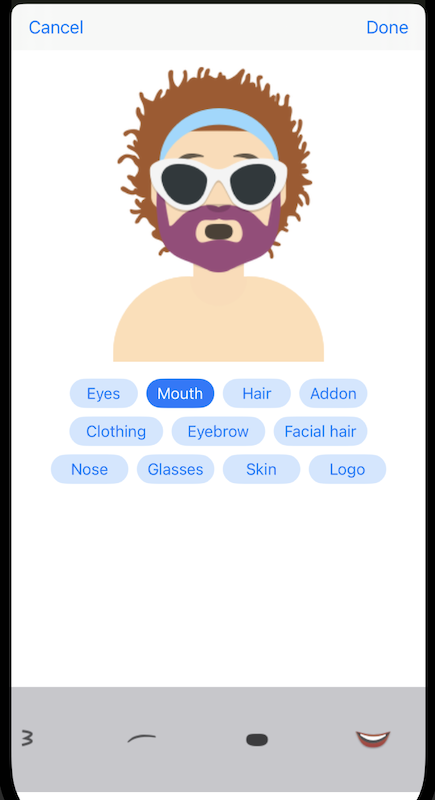
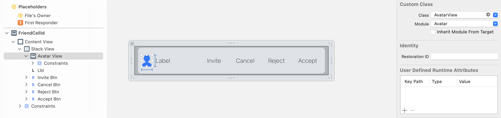

# Avatar

An iOS package for automatic creating and editing avatars.


    


### Avatar editing
```swift
#import Avatar
...
let vc = EditAvatarViewController.instantiate()
vc.avatar = Avatar.decompress(value: avatarId) // provide existing avatar id or some random int64 value
vc.delegate = self
self.present(vc, animated: true, completion: nil)
```


Delegate method that will be called when editing is done:
``` swift
public protocol EditAvatarViewControllerDelegate: AnyObject {
    func doneAvatar(_ avatar: Avatar)
}
```
Received avatar object can be compressed or presented with single 64 bit integer. You can use this as avatarId and store it to your server, sending it to other clients and present it locally.

### Show avatar
Put **AvatarView** into your layout (storyboard or xib) and set avatar id to it:
```swift
@IBOutlet weak var avatarView: AvatarView!
...
avatarView.avatarId = avatarId
```


### Installation
Tap on your main project, tab **Package dependencies** and add following url:
```swift
https://github.com/prcela/Avatar
```

### Preview in Yamb app
Checkout this [Yamb](https://apps.apple.com/us/app/yamb/id354188615) app to see this avatars in action, see how community builds many variations of these avatars.
We also have a similar functionality for Android, written in kotlin, feel free to contact us via *Yamb app*/*More*/*Contact us*.


