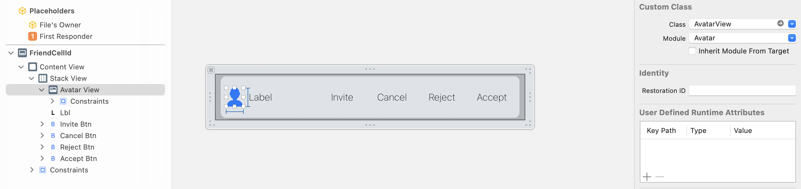

# Avatar

An iOS package for automatic creating and editing avatars.    

### Avatar editing
```swift
#import Avatar
...
let vc = EditAvatarViewController.instantiate()
vc.avatar = Avatar.decompress(value: avatarId) // provide existing avatar id or some random int64 value
vc.delegate = self
self.present(vc, animated: true, completion: nil)
```
### Show avatar
Put AvatarView into your layout (storyboard or xib) and set avatar id to it:
```swift
@IBOutlet weak var avatarView: AvatarView!
...
avatarView.avatarId = avatarId
```


### Instalation
