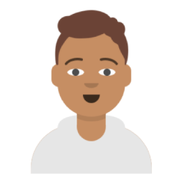
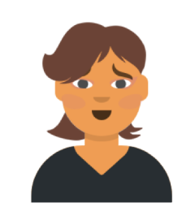
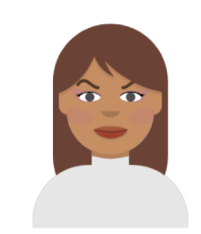
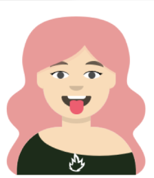
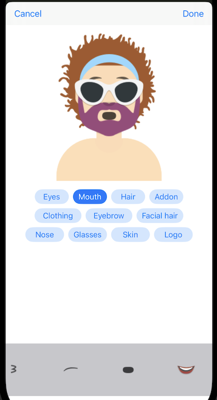
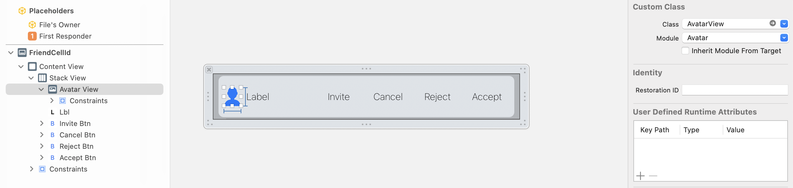

# Avatar

An iOS package for automatic creating and editing avatars.

  
  
  

### Avatar editing
```swift
#import Avatar
...
let vc = EditAvatarViewController.instantiate()
vc.avatar = Avatar.decompress(value: avatarId) // provide existing avatar id or some random int64 value
vc.delegate = self
self.present(vc, animated: true, completion: nil)
```


Delegate method that will be called when editing is done:
``` swift
public protocol EditAvatarViewControllerDelegate: AnyObject {
    func doneAvatar(_ avatar: Avatar)
}
```
Received avatar object can be compressed or presented with single 64 bit integer. You can use this as avatarId and store it to your server, sending it to other clients and present it locally.

### Show avatar
Put **AvatarView** into your layout (storyboard or xib) and set avatar id to it:
```swift
@IBOutlet weak var avatarView: AvatarView!
...
avatarView.avatarId = avatarId
```


### Installation via SPM
Tap on your main project, tab **Package dependencies** and add following url:
```swift
https://github.com/prcela/Avatar
```

### Preview in Yamb app
Checkout this [Yamb](https://apps.apple.com/us/app/yamb/id354188615) app to see this avatars in action, see how community builds many variations of these avatars.
We also have a similar functionality for Android, written in kotlin, feel free to contact us via *Yamb app*/*More*/*Contact us*.


### Face proportions and editor

The new UIKit editor is created programmatically by `AvatarEditorViewController.instantiate()`.
The original `EditAvatarViewController` and its storyboard remain available.
It keeps a live preview visible and groups parts into Face, Hair and Style. Eyes have
independent size and spacing controls; Mouth has width and Nose has size. Each control
has three choices. Reset proportions only resets the selected part, and Cancel discards
the draft. The existing `EditAvatarView.xib` remains the shared rendering canvas.

`Avatar.eyeSize`, `mouthWidth` and `noseSize` use `FeatureSize` (`normal = 0`,
`small = 1`, `large = 2`). `Avatar.eyeSpacing` uses `EyeSpacing` (`normal = 0`,
`narrow = 1`, `wide = 2`). Save `compressHex()` together with `legacyAvatarId`.

The high word of `AvatarHexID` allocates these bits (the low word is unchanged):

| Bits | Field | Values |
| --- | --- | --- |
| 30 | Clothing bit 5 | Existing extension for clothing 32...63 |
| 31...32 | Eye spacing | 0 normal, 1 narrow, 2 wide, 3 reserved |
| 33...34 | Eye size | 0 normal, 1 small, 2 large, 3 reserved |
| 35...36 | Mouth width | 0 normal, 1 narrow, 2 wide, 3 reserved |
| 37...38 | Nose size | 0 normal, 1 small, 2 large, 3 reserved |
| 39...63 | Reserved | Preserve on unrelated edits |

Zero preserves all previous rendering. Each eye moves an additional -5 / 0 / +5
points per side on the 264-point canvas, on top of body-width positioning. Separate
eyebrows follow the spacing; the unibrow stays connected. Eyes scale to 0.8 / 1 / 1.2
about each half's center. Mouth width and nose size use 0.85 / 1 / 1.15. The mouth's
height is unchanged. Unsupported proportion values render as normal but survive until
that specific control is explicitly changed. Clients without these controls retain
the bits but show their original proportions; their renderer needs the same update
to display the new appearance. The server already preserves the full hex ID.
