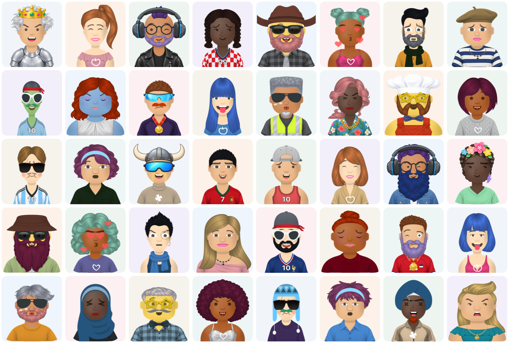
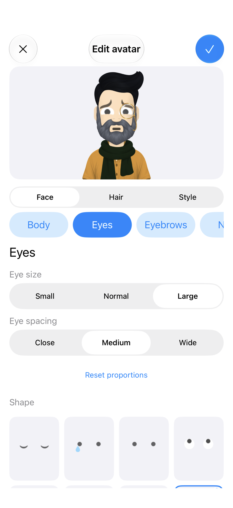

# Avatar



A customizable iOS avatar package with a live UIKit editor, UIKit and SwiftUI views, and a compact **32-character hex string** that stores the complete avatar. Requires **iOS 15+** and **Swift tools 5.7+**.

The gallery above is rendered by the package itself. Its 40 reproducible IDs are listed in [avatar-grid.json](Docs/avatar-grid.json), in row order.

## Installation

In Xcode, open **Package Dependencies**, add [prcela/Avatar](https://github.com/prcela/Avatar), and link the **Avatar** library to your app target.

```swift
import Avatar
```

## The avatar ID is now a string

Use `avatar.compressHex()` as the primary ID for persistence and networking:

```swift
let hexId: String = "00000000325e00000c8849616c39285a"
let avatar = Avatar.decompress(value: 0, hexId: hexId)

let savedHexId: String = avatar.compressHex()
UserDefaults.standard.set(savedHexId, forKey: "avatarHexId")
```

An ID contains **128 bits**, encoded as exactly **32 hexadecimal characters**, including leading zeros. The first 16 characters hold extensions; the last 16 hold the original legacy word. It is a description of the avatar's parts and proportions, so the same ID recreates the same appearance with the same assets and renderer.

- Store and send the complete ID as a **string**. Do not convert it to `Int64`, a floating-point number, or a JavaScript `Number`.
- Input accepts `0...9`, `a...f`, and `A...F`. Output is normalized to lowercase.
- A `0x` prefix, whitespace, missing leading zeros, or a length other than 32 makes the ID invalid.
- `AvatarHexID(hexId)` validates the format and returns `nil` for invalid input. Syntactically valid IDs may still contain reserved or future field values.
- `Avatar.decompress(value:hexId:)` prefers a valid hex ID. An empty or malformed string falls back to the supplied legacy `value`.

For example, a JSON payload can contain:

```json
{
  "avatarHexId": "00000000325e00000c8849616c39285a"
}
```

Keep the string intact on your server. Unknown fields and reserved bits survive a decode/edit/encode cycle when unrelated properties are changed. Unsupported options use a rendering fallback until the client supports them.

### Migrating from `Int64`

Existing avatar IDs still work:

```swift
let oldAvatarId: Int64 = 903052408064125018

// Preserve the old identity exactly, with a zero extension word.
let migratedHexId = AvatarHexID(legacyID: oldAvatarId).hex
// "00000000000000000c8849616c39285a"

// During rollout, load both fields. A valid string takes precedence.
let avatar = Avatar.decompress(value: oldAvatarId, hexId: migratedHexId)

// Save the full appearance and, if needed, a fallback for older clients.
let avatarHexId = avatar.compressHex()
let legacyAvatarId = avatar.legacyAvatarId
```

`legacyAvatarId` is the low 64-bit word of the full ID. It cannot carry extended hairstyles, colors, clothing, body types, or face proportions. Older clients may therefore show a different appearance. `compress()` remains available for legacy integrations; use **`compressHex()` for all new saves** and `legacyAvatarId` when a legacy fallback is required.

## Avatar editor

<p align="center">
  
</p>

The current `AvatarEditorViewController` is built in UIKit. It keeps the preview visible and organizes options into **Face**, **Hair**, and **Style**. Users can choose body width, parts, colors, accessories, shirt logos, jersey numbers, and independent eye size, eye spacing, mouth width, and nose size.

```swift
// Inside your view controller:
let editor = AvatarEditorViewController.instantiate()
editor.avatar = Avatar.decompress(value: 0, hexId: savedHexId)
editor.delegate = self
present(editor, animated: true)
```

The editor works on a draft. **Cancel** leaves the original avatar untouched; **Done** returns the edited avatar through the existing delegate protocol:

```swift
extension ProfileViewController: EditAvatarViewControllerDelegate {
    func doneAvatar(_ avatar: Avatar) {
        let hexId = avatar.compressHex()
        UserDefaults.standard.set(hexId, forKey: "avatarHexId")

        // Keep this only if older clients still need a numeric fallback.
        UserDefaults.standard.set(avatar.legacyAvatarId, forKey: "avatarId")

        avatarView.setAvatar(avatarHexId: hexId)
    }
}
```

Here, `avatarView` is a `UIAvatarView`. **Reset proportions** resets only the selected part. Jersey numbers run from **0 to 99**; choosing **No number** restores the shirt logo. The original storyboard-based `EditAvatarViewController` remains available, but the screenshot and example use the current editor.

## Display an avatar

### UIKit

Use `UIAvatarView`, including as the custom class of an image view in a storyboard or XIB:

```swift
let avatarView = UIAvatarView()
avatarView.contentMode = .scaleAspectFit
avatarView.setAvatar(avatarHexId: savedHexId)

// Or supply both fields during migration:
avatarView.setAvatar(avatarId: oldAvatarId, avatarHexId: savedHexId)
```

Add the view to your layout and give it a frame or constraints. Set `small = true` **before** assigning the ID only when a 30 x 30 cached thumbnail is sufficient.

### SwiftUI

`AvatarView` is the SwiftUI view; `UIAvatarView` is its UIKit counterpart.

```swift
AvatarView(avatarHexId: savedHexId)
    .frame(width: 120, height: 120)

// A small view with a legacy fallback:
AvatarView(avatarID: oldAvatarId, avatarHexId: savedHexId, small: true)
    .frame(width: 30, height: 30)
```

### UIImage

```swift
let image = AvatarCache.fetchImage(
    avatarId: 0,
    avatarHexId: savedHexId,
    small: false
)
```

Use the editor, views, and image cache on the main thread. The cache keys images by the normalized full hex ID. Call `AvatarCache.didReceiveMemoryWarning()` to clear cached images when needed.

## How many avatars are possible?

The current catalog supports **2,394,815,603,007,360,484,224,000 human-avatar configurations** (approximately **2.39 x 10^24**) when all supported option values are combined.

| Option | Choices |
| --- | ---: |
| Body widths | 5 |
| Skin colors | 9 |
| Eyes x eye sizes x eye spacings | 18 x 3 x 3 |
| Eyebrows | 14 |
| Noses x nose sizes | 5 x 3 |
| Mouths x mouth widths | 26 x 3 |
| Hairstyles / headwear x colors | 65 x 28 |
| Facial hair x colors | 13 x 28 |
| Clothing x colors | 34 x 26 |
| Shirt logos | 27 |
| Glasses | 21 |
| Accessories x colors | 23 x 26 |
| Jersey number settings | 101 (none, plus 0...99) |

```text
5 x 9 x (18 x 3 x 3) x 14 x (5 x 3) x (26 x 3)
  x (65 x 28) x (13 x 28) x (34 x 26) x 27 x 21 x (23 x 26) x 101
= 2,394,815,603,007,360,484,224,000
```

This is a count of **stored configurations, not distinct rendered images**. It includes independent values that can be hidden or inactive: hair color with no hair, colors on fixed-color garments, numbers on non-jerseys, a logo hidden by a jersey number, or facial features covered by an accessory. `None` is included where available; retired and reserved choices are excluded. The editor only exposes contextual controls when they apply.

The optional bot skin mode doubles the stored configuration count to **4,789,631,206,014,720,968,448,000**. It is outside the human editor's body choices and renders as a bot only when `UIAvatarView.enableBots` is enabled. The full 128-bit format has `2^128` possible bit patterns, but reserved patterns are **not** additional supported avatar options.

## ID format and advanced use

`AvatarHexID` exposes individual packed fields. For example, proportions can be changed without rebuilding the rest of the identity:

```swift
if var id = AvatarHexID(savedHexId) {
    id.bodyType = Avatar.BodyType.slim.rawValue
    id.eyeSize = Avatar.FeatureSize.large.rawValue
    id.eyeSpacing = Avatar.EyeSpacing.wide.rawValue

    let updatedHexId: String = id.hex
    avatarView.setAvatar(avatarHexId: updatedHexId)
}
```

Use supported catalog values when changing raw fields. See [the hex ID reference](Docs/hex-id.md) for bit positions, reserved values, and face-proportion behavior.

## In use

See the avatars in [Yamb on the App Store](https://apps.apple.com/us/app/yamb/id354188615). A Kotlin implementation is also used on Android; contact us through **Yamb > More > Contact us** for details.
